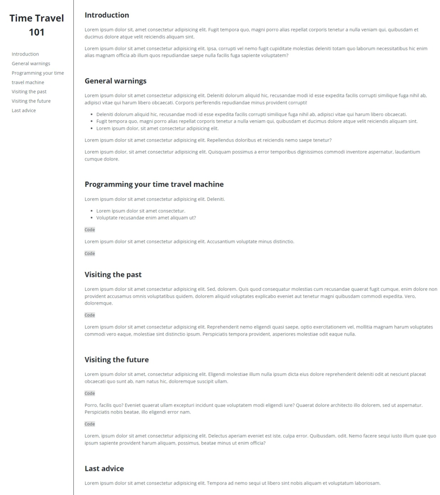
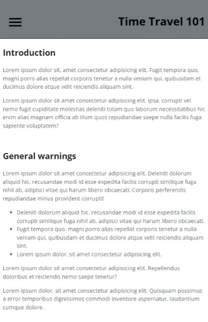

# Technical Documentation Page: Time Travel 101
This technical documentation page presents with a clear and simple design the general rules of time travel. It is the fourth project for the Responsive Web Design Certification delivered by FreeCodeCamp.

To make the navigation on smaller screens more user-friendly I decided to implement a hamburger menu.

This project was built with:
- Semantic HTML5 markup
- CSS properties
- Media queries

And tested with:
- The web accessibility evaluation tool (WAVE)
- The Markup Validation Service of W3C

## Live site

- Live Site URL: [GitHub Page](https://ax-cd.github.io/technical-documentation-page-fcc-project/)

## Screenshots
Desktop design followed by tablet and mobile design.

## Links

- Frontend Mentor - [@Ax-cd](https://www.frontendmentor.io/profile/Ax-cd)
- Instagram - [@ax.coding](https://www.instagram.com/ax.coding/)

## Resources

- Hamburger menu: out of all blog posts and articles I came across, this one helped me the most. It's clear and to the point: ["CSS only menu toggle - no JavaScript required" on Out of Scope](https://www.outofscope.com/css-only-menu-toggle-no-javascript-required/)
